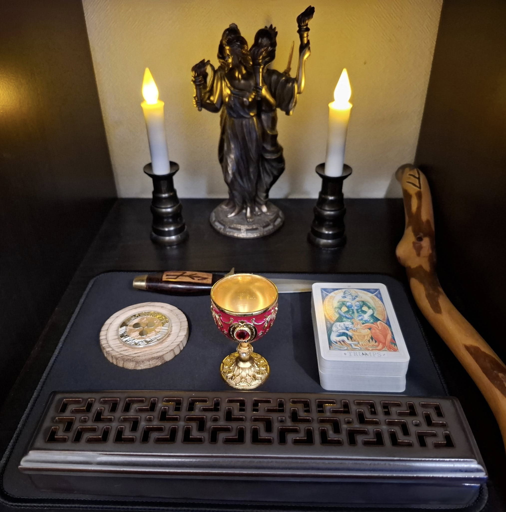

## 🔮🌅 ヘカテの日拝 v0.1

【概要】
このプロトコルは、夜の女神であるヘカテに朝の光のもとで祈りを捧げることで、自身の一日を祝福し、心の均衡と力を得るための簡易な儀式です。短く、毎日続けられることを重視しています。

---

## 1. 準備

- 電池式のろうそく（2本）を灯す
- お香を焚く（オプション：火の取り扱いに注意し、家族や同居人との相談を推奨）
- カップに清浄な水を注ぐ
- 必要に応じて、短い鐘（おりん）を鳴らす

---

## 2. 祈りの言葉

> Hail Hekate, Keeper of the Keys, Goddess of the Crossroads and the Night.  
> Bless this day with clarity, strength, and protection.  
> May your light guide me through shadow and trial.  
> So mote it be.

（訳：
鍵の守護者、十字路と夜の女神ヘカテよ、
この日を明晰さと強さ、そして守護で祝福してください。
あなたの光が影と試練の中でも私を導きますように。
そうあれかし。）

---

## 3. 終了

- 水を少量床にそっと注いで捧げ、感謝の意を示す
- 「ありがとう、ヘカテ」と一言唱える
- ろうそくを消す（電池式の場合はスイッチをオフ）

---

## 🌙 例：ヘカテ神殿での日拝

以下は、ヘカテ神殿で日拝を実施している実例写真です。

この儀式は、本棚神殿やフラフープ魔法円など、限られたスペースでも実施できます。

---

🌀本プロトコルは「Open Source Witchcraft」プロジェクトの一環として公開されています。
誰でも実践可能で、改変・共有自由な魔術プロトコルです。
